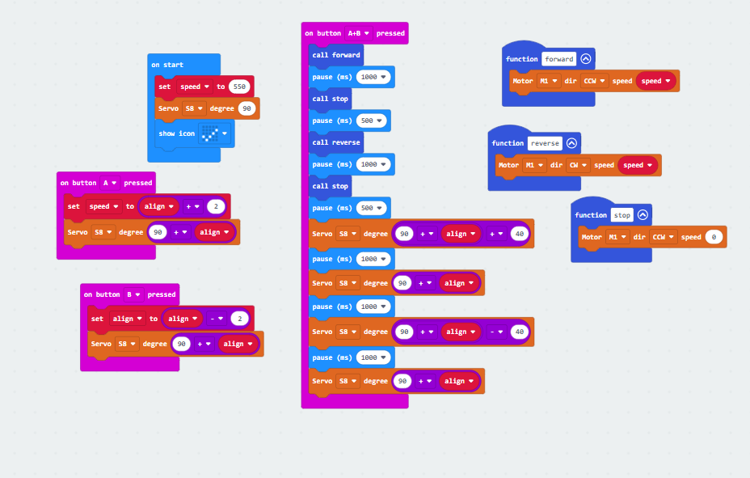
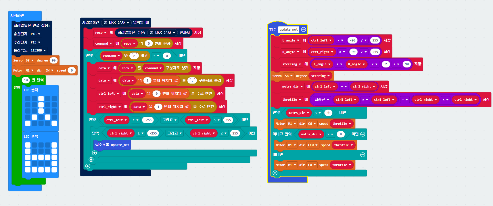

# [🔥OpenBot 프로젝트🔥](https://www.notion.so/OpenBot-04b04546aec54d9ab4404e575920705d)

# 그룹: 이과!

# 팀: 서박서박!😎(서성민,박준영)

### 팀 소개: 각자의 성을 따서 만듦

[https://github.com/P-hongsi/OpenBot](https://github.com/P-hongsi/OpenBot)

# OpenBot이란?

<aside>
💡 OpenBot은 오픈소스 기반의 안드로이드 스마트폰을 이용한 로봇 플랫폼입니다.

OpenBot은 안드로이드 스마트폰을 사용하여 저렴하게 로봇을 만들 수 있습니다. 안드로이드 스마트폰은 이미 카메라, 센서, 프로세서 등 로봇에 필요한 여러 기능들을 가지고 있기 때문에 로봇의 하드웨어 구성을 간편하게 할 수 있습니다.

또한, OpenBot은 오픈소스 기반으로 개발되어 있어 개발자들이 쉽게 기능을 확장하고 수정할 수 있습니다. 이를 통해 로봇을 보다 유연하게 제어할 수 있습니다.

OpenBot은 로봇 개발을 쉽고 저렴하게 만들어주는 훌륭한 플랫폼입니다.

</aside>

# 문제 상황

- Who : 고령 운전자(55세 이상)
- What :  최근 10년 동안 고령 운전자에 의한 사고가 1.4배 늘었다.                [https://www.korea.kr/news/policyNewsView.do?newsId=14888](https://www.korea.kr/news/policyNewsView.do?newsId=148881191)

> 출처:(대한민국 공식 전자정부 누리집)
> 
- When : 판단 능력이 흐려지는 고령 운전자가 운전대를 잡을 때이다.
- Why  : 고령 운전자의 실수를 인공지능이 보완해줌으로써 사고 확률을 낮춰주어 인명 피해를 줄일 수 있다.

# 마이크로비트 코드

- 각도 조절 및 전진, 후진, 좌회전, 우회전 코드

> 작동 영상
> 

[20230714_150723.mp4](src/go_back.gif)

- 폰과 시리얼 통신 코드

> 작동 영상
>
