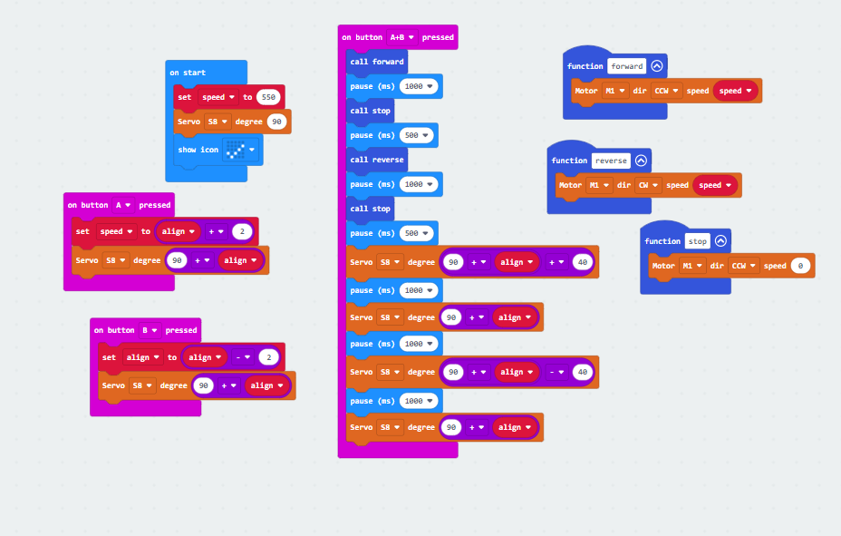

# [🔥OpenBot 프로젝트🔥](https://github.com/P-hongsi/OpenBot)

# 그룹: 이과!

# 팀: 서박서박!😎(서성민,박준영)

### 팀 소개: 각자의 성을 따서 만듦

[🔥OpenBot 프로젝트🔥](https://p-hongsi.github.io/OpenBot/)

# OpenBot이란?

<aside>
💡 OpenBot은 오픈소스 기반의 안드로이드 스마트폰을 이용한 로봇 플랫폼입니다.
OpenBot은 안드로이드 스마트폰을 사용하여 저렴하게 로봇을 만들 수 있습니다. 안드로이드 스마트폰은 이미 카메라, 센서, 프로세서 등 로봇에 필요한 여러 기능들을 가지고 있기 때문에 로봇의 하드웨어 구성을 간편하게 할 수 있습니다.
또한, OpenBot은 오픈소스 기반으로 개발되어 있어 개발자들이 쉽게 기능을 확장하고 수정할 수 있습니다. 이를 통해 로봇을 보다 유연하게 제어할 수 있습니다.
OpenBot은 로봇 개발을 쉽고 저렴하게 만들어주는 훌륭한 플랫폼입니다.
</aside>

# 문제 상황

- Who : 고령 운전자(55세 이상)
- What :  최근 10년 동안 고령 운전자에 의한 사고가 1.4배 늘었다.

[고령자 운전면허 반납·인센티브 신청, 주민센터서 한 번에](https://www.korea.kr/news/policyNewsView.do?newsId=148881191)

> 출처:(대한민국 공식 전자정부 누리집)
> 
- When : 판단 능력이 흐려지는 고령 운전자가 운전대를 잡을 때이다.
- Why  : 고령 운전자의 실수를 인공지능이 보완해줌으로써 사고 확률을 낮춰주어 인명 피해를 줄일 수 있다.

# 마이크로비트 코드

- 각도 조절 및 전진, 후진, 좌회전, 우회전 코드

> 작동 영상
> 

[https://youtu.be/3X7YW5RNTCY](https://youtu.be/3X7YW5RNTCY)

- 폰과 시리얼 통신 코드

> 작동 영상
> 

[https://youtu.be/toLFZzBLeAA](https://youtu.be/toLFZzBLeAA)

# 트랙 데이터 수집 및 학습

> 데이터 수집 과정 영상
> 

[https://youtu.be/P3uWY4jA0OA](https://youtu.be/P3uWY4jA0OA)

> 데이터 학습 코드(colab)
> 

[https://youtu.be/LP3kOfOQQqQ](https://youtu.be/LP3kOfOQQqQ)

> 학습한 모델을 이용하여 자율 주행 영상
> 

[https://youtu.be/8GOpPLguz4s](https://youtu.be/8GOpPLguz4s)

# 1일차

**문제:**

먼저, 사람을 따라오는 작업을 하였을 때 왼쪽으로 가면  따라오지만 오른쪽으로 가면 따라오지 않는 이슈가 있었다.

**원인(추측):**

일단 핸드폰 화면을 돌리지 않았다. 

**해결 방안:**

핸드폰 화면을 돌렸다.

# 2일차

**문제:**

코너 부분에서는 잘 했지만  직선 부분에서 특정한 이미지가 입력 되었을때 멈추는 문제가 생겼다.  

**원인(추측):**

무슨 문제가 인지 생각해본 결과 항상  같은 부분에서 멈추게 한 것이  화근이었다.   

같은 부분에서 멈추니  다른 직선 부분에서 동일한 각도와 프레임이 나왔을 때  멈추게 되었다.

**해결 방안:**

데이터를 더 많이 추가하여  직선 부분을 보강하였다.

# 소감

직접 데이터를 만들고 생각하면서 데이터를 학습시킨 후 성공시킨 쾌감은 이루말할 수 없다.

이런 자그마한 장난감 크기 정도의 차량의 자율 주행을 하는데도 많고 질 좋은 데이터 수집과 40분 정도의 데이터 모델링 작업이 필요하다는 것을 알게되었다.

요새 많이 보이는 테슬라와 같은 차량은 얼마나 많은 노력과 데이터를 넣어야하는지 알게되는 시간이었다.

# [학습 데이터 자료(.ipynb,.zip,.tflite)](https://drive.google.com/drive/folders/1_5sig7RCIWp2seSFe4nVnZUqgM6Dnzo9?usp=drive_link)
